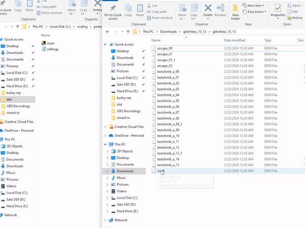

# Msushi Portal Demo Autosubmitter
A python program that automatically submits your Portal speedruns to speedrun.com. Just drag and drop your demos on the program!

## Download
If you are just here to download, please head over to the [releases page](https://github.com/Msushi/portal-demo-autosubmitter/releases).

## Supported Runs

Here is a table of currently supported Portal speedruns:

| Speedrun | Supported |
| -------------------- | :-: |
| Portal | ✅ |
| Portal IL | ✅ |
| Portal 2 Chapters | ❌ |
| Portal 2 | ❌ |